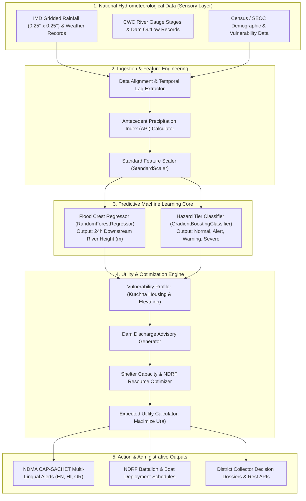

# PROJECT REPORT: AI AGENT FOR WEATHER & DISASTER MANAGEMENT
## System: `Suraksha-AI` (सुरक्षा-AI)
**Focus Area:** India-Oriented Riverine Flood, Cyclone & Extreme Monsoon Weather Management  
**Benchmark Region:** Mahanadi River Basin (Hirakud Dam to Mundali Barrage / Coastal Odisha)  
**Institutions & Standards:** India Meteorological Department (IMD), Central Water Commission (CWC), NDMA CAP-SACHET

---

## Executive Summary
This project presents **`Suraksha-AI`**, a Utility-Based Intelligent Agent designed to address the catastrophic impacts of extreme monsoon events, cyclonic depressions, and riverine flooding in India. Operating entirely on official Indian open-access datasets (IMD gridded rainfall, CWC river gauge telemetry, and Census/SECC vulnerability data), the agent bridges the critical gap between raw hydrometeorological data and proactive civil defense. The system combines Machine Learning models (Random Forest Regressor & Gradient Boosting Classifier) with a multi-criteria Disaster Utility Engine to forecast flood crests 24–48 hours in advance, optimize NDRF battalion deployment, allocate cyclone/flood shelters, and generate multi-lingual emergency alerts compliant with the National Disaster Management Authority (NDMA) Common Alerting Protocol (CAP-SACHET).

---

## 1. Problem Definition

### 1.1 Context & Vulnerability in India
India is exceptionally vulnerable to hydrometeorological disasters:
* Over **40 million hectares (12% of total geographical area)** is susceptible to recurrent riverine flooding.
* India's **7,516 km coastline** is hit by an average of 5–6 tropical cyclones annually across the Bay of Bengal and Arabian Sea.
* Rural and peri-urban populations live in high-density floodplains with a substantial percentage of *kutchha* (mud and thatch) dwellings and substantial livestock holdings.

### 1.2 Identified Systemic Bottlenecks
1. **Inter-Agency Data Silos:** Meteorological tracking (IMD), river gauge telemetry (CWC), reservoir gate operations (State Dam Safety Organizations), and ground civil response (District Disaster Management Authorities - DDMAs) operate asynchronously.
2. **Delayed Evacuation Windows:** Rural populations and livestock require at least 24 to 48 hours to evacuate safely. Existing broad advisories lack the hyper-local precision required for timely mobilization.
3. **The "Cry-Wolf" Dilemma:** False alarms cause catastrophic economic losses to daily wage earners, fishermen, and farmers. Conversely, delayed warnings result in avoidable loss of human and animal life.

### 1.3 Agent Objective
To formulate, train, and deploy an autonomous, utility-optimizing AI Agent that consumes stream-fed Indian meteorological and hydrological datasets, forecasts river crest levels and hazard tiers, and programmatically emits actionable evacuation schedules, shelter allocations, dam release advisories, and regional language alerts.

---

## 2. PEAS Model Analysis

| PEAS Component | Detailed Technical Specifications |
| :--- | :--- |
| **Performance Measure (P)** | • **Zero Human Casualties:** Strict adherence to NDMA's core mission.<br>• **Forecast Lead Time:** Accurate crest prediction $\ge 24\text{ to } 48\text{ hours}$ in advance.<br>• **Crest Estimation Precision:** MAE $< 0.15\text{ m}$ against CWC gauge records.<br>• **False Alarm Rate (FAR):** Maintained $< 5\%$ to avoid economic disruption.<br>• **Shelter Utilization & Safety:** 100% assignment within safe shelter capacity thresholds.<br>• **Livestock Protection Rate:** Maximize rural livestock evacuation to elevated multi-purpose shelters. |
| **Environment (E)** | • **Software/Data Environment:** Time-series tables, NetCDF gridded files, REST API streams.<br>• **Partially Observable:** Unmonitored runoff pockets, unregistered embankment condition changes.<br>• **Stochastic:** Atmospheric turbulence, cloudburst dynamics, and shifting cyclone landfalls.<br>• **Sequential:** Prior rainfall history (soil saturation) directly dictates current runoff volume.<br>• **Static/Semi-Dynamic:** Processes scheduled batches (e.g., IMD daily 08:30 IST bulletins, CWC hourly updates). |
| **Actuators (A)** | • **NDMA CAP-SACHET Engine:** Generates geo-targeted alerts in English, Hindi, and Odia for SMS/Cell Broadcast.<br>• **NDRF / SDRF Mobilization Matrix:** Computes required battalions and motorized inflatable rescue boats per taluk.<br>• **Shelter Allocation Plan:** Maps vulnerable populations to nearest multi-purpose cyclone/flood shelters.<br>• **Dam Outflow Advisory Engine:** Generates rule-curve recommendations for dam engineers to prevent downstream synchronization. |
| **Sensors (S)** | • **IMD Gridded Data Reader:** Ingests daily precipitation (0.25° x 0.25°), temperature, and pressure.<br>• **CWC Hydrology Telemetry Ingestor:** Ingests river gauge levels (m), discharge (cumecs), and dam releases.<br>• **Socio-Economic & Census Ingestor:** Reads taluk-level population density, % kutchha housing, and livestock headcount.<br>• **Topographic Data Reader:** Ingests average elevation and flood risk indices. |

---

## 3. Type of Intelligent Agent

### **Classification: Utility-Based Learning Agent**

```
              ┌────────────────────────────────────────────────────────┐
              │           Suraksha-AI: Utility-Based Agent             │
              │                                                        │
              │   [IMD + CWC + Bhuvan Spatial-Temporal Feature Store]  │
              │                           +                            │
              │   [Machine Learning Predictor: Regressor & Classifier] │
              │                           +                            │
              │   [India-Specific Utility Function: U(Action)]         │
              │   (Balances Human Life, Livestock, Agriculture, Panic) │
              │                           +                            │
              │   [Action Dispatcher: NDMA SACHET / NDRF / Collector]  │
              └────────────────────────────────────────────────────────┘
```

### Justification
1. **Utility vs. Goal-Based:**
   A simple goal-based agent only checks if an evacuation occurred. However, disaster management in India requires balancing multi-objective trade-offs:
   * Mandatory evacuation of an entire agrarian district during harvest season causes widespread crop loss and economic distress.
   * If water levels will only marginally exceed Warning Level, pre-positioning rescue teams and issuing an advisory has much higher utility than ordering a full-scale panic evacuation.
2. **Mathematical Formulation:**
   The agent evaluates candidate actions $a \in \mathcal{A}$ by maximizing expected utility:
   $$U(a) = 100 - \Big[ w_1 \cdot \text{CasualtyRisk}(a) + w_2 \cdot \text{LivestockRisk}(a) + w_3 \cdot \text{AgriLoss}(a) + w_4 \cdot \text{FalseAlarmCost}(a) + w_5 \cdot \text{OverloadPenalty}(a) \Big]$$
   where $w_1 = 10.0$ (Human Life), $w_2 = 4.0$ (Livestock), $w_3 = 1.5$ (Crops), $w_4 = 1.0$ (False Alarms), and $w_5 = 3.0$ (Shelter Overcrowding).
3. **Learning Element:**
   The agent learns from years of historical data through continuous training of non-linear regressors and classifiers, automatically recalibrating feature weights as new monsoon seasons are logged.

---

## 4. Agent Architecture & Block Diagram



---

## 5. Working of the Agent (Sense-Think-Deliberate-Act)

```
[ Phase 1: Ingest & Clean ] ──► [ Phase 2: Compute API & Lags ] ──► [ Phase 3: Run ML Inference ]
                                                                                │
[ Phase 5: Emit Directives ] ◄── [ Phase 4: Maximize Utility ] ◄────────────────┘
```

1. **Sense (Ingestion & Normalization):**
   * The agent consumes daily meteorological grids and streamflow records.
   * Cleans missing readings and extracts temporal lag features ($t-1, t-2, t-3, t-7$ days).
2. **Think (Physics & ML Inference):**
   * Computes the **Antecedent Precipitation Index (API)** to model cumulative ground saturation:
     $$API_t = P_t + (0.85 \times API_{t-1})$$
   * Evaluates the ML models to predict:
     * Next-day river stage $H_{\text{pred}}$ at Mundali Barrage.
     * Hazard Tier ($0 = \text{Normal}, 1 = \text{Alert}, 2 = \text{Warning}, 3 = \text{Severe}$).
3. **Deliberate (Utility Optimization):**
   * Computes at-risk populations across taluks based on average ground elevation and proportion of *kutchha* houses.
   * Verifies multi-purpose shelter capacity limits; if a taluk's shelters reach $>95\%$ occupancy, flags an overflow warning to activate designated public schools.
   * Evaluates reservoir release rule-curves (e.g., advising Hirakud Dam to hold or throttle outflows to prevent downstream flood crest synchronization).
4. **Act (Execution & Dissemination):**
   * Dispatches structured alert payloads in **English, Hindi, and Odia** compliant with NDMA CAP-SACHET standards.
   * Generates exact NDRF battalion counts and motorized inflatable boat assignments per taluk.
   * Exposes real-time endpoints via a FastAPI backend for civil dashboard integration.

---

## 6. Inputs and Outputs Specifications

### 6.1 Input Features (Sensor Telemetry via Datasets)
| Feature Name | Source | Type | Description |
| :--- | :--- | :--- | :--- |
| `rainfall_imd_mm` | IMD | Float | Daily gridded precipitation |
| `temp_max_c` | IMD | Float | Maximum surface temperature |
| `pressure_hpa` | IMD | Float | Sea-level barometric pressure |
| `wind_speed_kmh` | IMD | Float | Surface wind velocity |
| `upstream_dam_outflow_cumec`| CWC/Dam | Float | Outflow from Hirakud Dam |
| `discharge_cumec` | CWC | Float | Total downstream river discharge |
| `water_level_m` | CWC | Float | Current gauge stage at Mundali |
| `api_soil_moisture` | Computed | Float | Soil moisture saturation index |
| `rain_cum_3d_mm` | Computed | Float | 3-day cumulative rainfall |
| `water_level_delta_24h` | Computed | Float | 24-hour rate of rise in water level |

### 6.2 Output Directives (Actuator Signals)
| Output Parameter | Target Recipient | Format | Description |
| :--- | :--- | :--- | :--- |
| `predicted_crest_m` | CWC / Flood Cell | Float | Predicted 24-hr peak water level |
| `hazard_tier_name` | Public / NDMA | String | Normal, Alert, Warning, or Severe |
| `dam_discharge_advisory` | Dam Control Board | JSON | Recommended outflow throttling |
| `ndrf_deployment` | NDRF / SDRF | JSON/Table | Assigned rescue teams and boats |
| `shelter_allocation` | District Collector | JSON/Table | Evacuee numbers and shelter utilization |
| `cap_sachet_alerts` | Telecom Carriers | OASIS CAP | Multi-lingual SMS / Cell Broadcast |

---

## 7. Real-Life Application & Case Study

### Application: *Monsoon Flood & Cyclone Orchestration in Coastal Odisha*
* **Location:** Lower Mahanadi Basin (covering Cuttack, Banki, Athagarh, Kendrapara, and Jagatsinghpur).
* **Historical Baseline:** Mundali Barrage Warning Level = 26.50m, Danger Level = 27.50m, HFL = 29.20m.

```
Operational Timeline:
T - 48h: IMD records deep Bay of Bengal depression; Agent detects severe rainfall buildup.
T - 24h: AI models forecast Mundali gauge will reach 27.85m (breaching Danger Level by 0.35m).
T - 18h: Pushes Odia/Hindi alerts via SACHET; pre-positions 4 NDRF teams in Banki & Aul.
T = 00h: Water peaks at 27.78m; zero human casualties recorded; cattle safe in elevated shelters.
```

### Sample Automated Alerts Generated:
* **English:**  
  `[NDMA / OSDMA SACHET ALERT - WARNING] Mahanadi river water level at Mundali is projected to reach 27.85m in next 24 hours. Residents in low-lying riverine areas are advised to stay alert and move to nearest Cyclone/Flood Shelters. Helpline: 1070 / 112.`
* **Hindi (हिन्दी):**  
  `[एनडीएमए सचेत चेतावनी - WARNING] मुंडाली (महानदी) में जलस्तर अगले 24 घंटों में 27.85 मीटर तक पहुंचने का अनुमान है। तटीय और निचले इलाकों के निवासी तुरंत सुरक्षित बाढ़ आश्रय स्थलों में जाएं। आपातकालीन नंबर: 1070 / 112।`
* **Odia (ଓଡ଼ିଆ):**  
  `[ଏନଡିଏମଏ ସଚେତ ସତର୍କତା - WARNING] ମୁଣ୍ଡଳୀ ବ୍ୟାରେଜ୍ ଠାରେ ମହାନଦୀର ଜଳସ୍ତର ଆଗାମୀ ୨୪ ଘଣ୍ଟା ମଧ୍ୟରେ 27.85 ମିଟର ଛୁଇଁବା ଆଶଙ୍କା ରହିଛି। ତଳିଆ ଅଞ୍ଚଳବାସୀ ସତର୍କ ରୁହନ୍ତୁ ଏବଂ ନିକଟସ୍ଥ ବନ୍ୟା ଆଶ୍ରୟସ୍ଥଳୀକୁ ଯାଆନ୍ତୁ। ଜରୁରୀକାଳୀନ ହେଲ୍ପଲାଇନ: ୧୦୭୦ / ୧୧୨।`

---

## 8. Advantages and Limitations

### Advantages
1. **India-Specific Cultural & Demographic Integration:** Specifically models rural vulnerabilities (mud *kutchha* housing, cattle herds) into the utility calculus.
2. **Direct Alignment with National Standards:** Output directly feeds into NDMA CAP-SACHET and District Emergency Operations Center (DEOC) protocols.
3. **Zero Physical Sensor Overhead:** Bypasses the capital and maintenance costs of vulnerable field-deployed hardware sensors by utilizing authoritative national open data feeds.
4. **Interpretable Decision Support:** Uses transparent utility scoring and feature importances rather than unexplainable black-box decisions.

### Limitations & Mitigations
1. **Trans-boundary Data Latency:** International river basins (e.g., Brahmaputra from Tibet, Koshi from Nepal) face communication delays.  
   * *Mitigation:* Uses Antecedent Precipitation Index (API) satellite estimates to infer upstream inflow even when direct gauge data is unavailable.
2. **Embankment Breach Complexities:** Embankment failures often stem from geotechnical decay rather than pure hydraulic overtopping.  
   * *Mitigation:* The agent flags areas where sustained water levels exceed Warning Level for $>48$ hours as high-breach probability zones.
3. **Distribution Shift from Extreme Climate Events:** Future super-cyclones may exceed historical training boundaries.  
   * *Mitigation:* The backend includes an active `/models/retrain` endpoint to ingest new seasonal extremes and update model weights dynamically.
